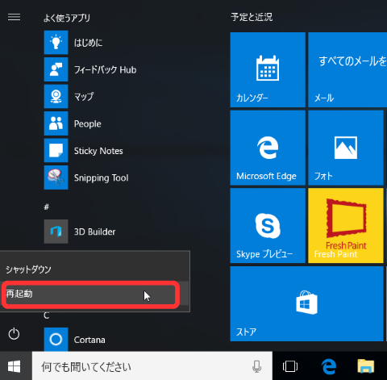
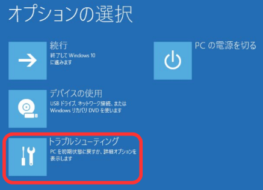
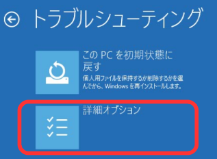
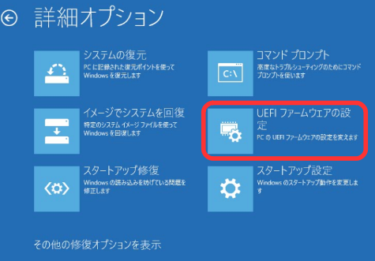
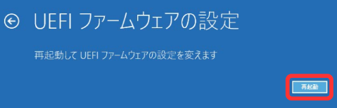

## 1.2.3 UEFI セットアップ画面

　OS から UEFI セットアップ画面への切り替え方法を解説します。まずは、実例として Windows 10 での操作方法を解説します。次に、UEFI アプリでの実装方法を解説します。この項では UEFI 変数の読み書きについて学びます。

## 1.2.3.1 Windows 10 で UEFI セットアップ画面へ切り替える操作方法

　Windows 10 1607(Anniversary Update)以降では、管理者権限でコマンドプロンプトを起動し、以下のコマンドを実行する方法も使用可能です。PC が再起動しますので、作業中のファイルを保存するなど、事前に必要な操作を済ませておいてください。

    shutdown /r /fw /t 0

　以下では、GUI による操作方法を解説します。

1.**「Shift キー」を押しながら**「再起動」をクリックします。

2.「トラブルシューティング」をクリックします。

3.「詳細オプション」をクリックします。

4.「UEFI ファームウェアの設定」をクリックします。

5.「再起動ボタン」をクリックします。

6.UEFI セットアップ画面が表示されます。

## 1.2.3.2 UEFI アプリで UEFI セットアップ画面へ切り替える実装方法

　UEFI セットアップ画面への画面遷移を行う UEFI アプリ UEFI_SetupScreen をダウンロードして、README.md に書かれた実行方法の手順に従って実行させてみてください。アプリ起動後に任意のキーを押すと、UEFI セットアップ画面へ切り替わります。未対応の環境では、PC がリセットされるだけです。

[UEFI アプリ UEFI_SetupScreen](https://github.com/tenpoku1000/UEFI_SetupScreen)

　UEFI アプリ UEFI_SetupScreen の主な処理は以下のファイルに記載しています。

[UEFI アプリ UEFI_SetupScreen の efi_main.c](https://github.com/tenpoku1000/UEFI_SetupScreen/blob/master/src/efi_main.c)

　efi_main 関数では PC は最後に必ずリセットされますが、UEFI セットアップ画面への画面遷移の機能が有効な場合は、その機能を呼び出すための処理を実行します。

    EFI_STATUS efi_main(EFI_HANDLE image_handle, EFI_SYSTEM_TABLE* system_table)
    {
        init(image_handle, system_table);

        if (is_boot_to_fw_ui()){

            Print(L"When you press any key, The system will transition to the UEFI setup screen.\n");

            set_boot_to_fw_ui();

        }else{

            Print(L"When you press any key, the system will reboot.\n");
        }

        reset_system(EFI_SUCCESS);

        return EFI_SUCCESS;
    }

　UEFI 変数 OsIndicationsSupported と、定数 EFI_OS_INDICATIONS_BOOT_TO_FW_UI とビット演算の論理積をとることで、これが真の場合は UEFI セットアップ画面への画面遷移の機能が有効です。偽の場合は、UEFI セットアップ画面への画面遷移の機能が無効です。SandyBridge/IvyBridge 世代向け GIGABYTE 製マザーボード GA-Z77-D3H の初期の UEFI では、UEFI セットアップ画面への画面遷移の機能が無効でした。

　RT->GetVariable() の第 2 引数の GUID に EfiGlobalVariable のポインタをセットしています。UEFI 変数の読み書きには UEFI 変数名と GUID を組み合わせることで、一意な UEFI 変数を特定する仕組みになっています。ここでは UEFI の規格で定められた UEFI 変数を特定するため、UEFI の規格で定められた GUID をセットするようにしています。EfiGlobalVariable という名前は規格で決まっているものではなく、利用するライブラリによって異なる名前になる可能性があります。

| UEFI 関数         | 機能              | 引数            | 型          |
| ----------------- | ----------------- | --------------- | ----------- |
| RT->GetVariable() | UEFI 変数の取得   | UEFI 変数名     | CHAR16*     |
|                   |                   | GUID            | EFI_GUID*   |
|                   |                   | 属性            | UINT32*     |
|                   |                   | UEFI 変数サイズ | UINTN*      |
|                   |                   | UEFI 変数       | VOID*       |

    static bool is_boot_to_fw_ui(void)
    {
        UINT32 attr = 0;
        UINT64 os_indications_supported = 0;

        EFI_STATUS status = get_variable_u64(L"OsIndicationsSupported", &attr, &os_indications_supported);

        if (EFI_ERROR(status)){

            error_print(L"get_variable_u64(OsIndicationsSupported) failed.\n", &status);
        }

        if (EFI_OS_INDICATIONS_BOOT_TO_FW_UI & os_indications_supported){

            return true;
        }

        return false;
    }

    static EFI_STATUS get_variable_u64(CHAR16* variable_name, UINT32* attr, UINT64* data)
    {
        UINTN data_size = sizeof(UINT64);

        EFI_STATUS status = RT->GetVariable(variable_name, &EfiGlobalVariable, attr, &data_size, data);

        switch (status){
        case EFI_NOT_FOUND:
    //      break;
        case EFI_SUCCESS:
            return EFI_SUCCESS;
        default:
            break;
        }

        return status;
    }

　UEFI 変数 OsIndications に、定数 EFI_OS_INDICATIONS_BOOT_TO_FW_UI とビット演算の論理和をとり、不揮発性(EFI_VARIABLE_NON_VOLATILE)・ブートサービス参照可能(EFI_VARIABLE_BOOTSERVICE_ACCESS)・ランタイムサービス参照可能(EFI_VARIABLE_RUNTIME_ACCESS)の属性で書き込みます。UEFI 2.6 仕様書の Table 11. Global Variables の Attribute に、NV, BS, RT と書かれているためです。

| UEFI 関数          | 機能              | 引数            | 型          |
| -----------------  | ----------------- | --------------- | ----------- |
| RT->SetVariable()  | UEFI 変数の設定   | UEFI 変数名     | CHAR16*     |
|                    |                   | GUID            | EFI_GUID*   |
|                    |                   | 属性            | UINT32      |
|                    |                   | UEFI 変数サイズ | UINTN       |
|                    |                   | UEFI 変数       | VOID*       |

    static void set_boot_to_fw_ui(void)
    {
        UINT32 attr = EFI_VARIABLE_NON_VOLATILE | EFI_VARIABLE_BOOTSERVICE_ACCESS | EFI_VARIABLE_RUNTIME_ACCESS;

        UINT64 os_indications = 0;

        os_indications |= EFI_OS_INDICATIONS_BOOT_TO_FW_UI;

        EFI_STATUS status = set_variable_u64(L"OsIndications", attr, &os_indications);

        if (EFI_ERROR(status)){

            error_print(L"set_variable_u64(OsIndications) failed.\n", &status);
        }
    }

    static EFI_STATUS set_variable_u64(CHAR16* variable_name, UINT32 attr, UINT64* data)
    {
        UINTN data_size = sizeof(UINT64);

        EFI_STATUS status = RT->SetVariable(variable_name, &EfiGlobalVariable, attr, data_size, data);

        switch (status){
        case EFI_SUCCESS:
            return EFI_SUCCESS;
        default:
            break;
        }

        return status;
    }

この後で PC をリセットすることで、UEFI 変数 OsIndications が UEFI で参照され、UEFI セットアップ画面への画面遷移が実行されます。UEFI セットアップ画面への画面遷移の機能が無効な機種では、単に PC がリセットされるだけです。

        reset_system(EFI_SUCCESS);

