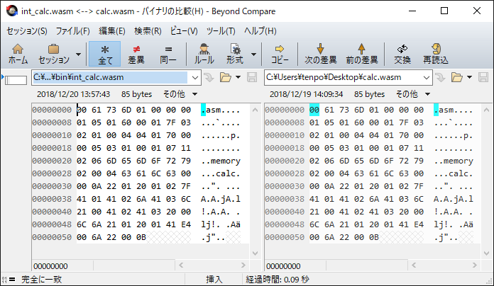

## 2.7 中間コード(WebAssembly)生成

構文解析が出力した構文木と、構文木に含まれる名前に関する情報を意味解析で登録したハッシュ表から取得し、中間コードを出力する処理を中間コード生成と呼びます。
本書の中間コードの形式は、WebAssembly バイナリ表現です。この章で作るコンパイラでは、
[int_calc_compiler/src/lib/tp_compiler/tp_make_wasm.c](https://github.com/tenpoku1000/int_calc_compiler/blob/master/src/lib/tp_compiler/tp_make_wasm.c)
：tp_make_wasm 関数が該当します。

この節は、WebAssembly の公式資料を参照しながら、読むようにすると理解が進むと思います。

Binary Format — WebAssembly  
https://webassembly.github.io/spec/core/binary/index.html

WebAssembly Specifications  
https://webassembly.github.io/spec/

日本語で読みたい方は、以下の電子書籍を参照してください。

WebAssemblyをはじめよう | WEBASSEMBLY USUI BOOK  
https://ukyo.github.io/wasm-usui-book/webroot/get-started-webassembly.html

### 2.7.1 既存のツール wabt を使って、WebAssembly を知る

Microsoft Store から、WSL の Ubuntu をインストールしてください。この節の執筆時には Ubuntu 20.04 LTS を利用しました。WSL の Ubuntu で、以下の手順で wabt をビルドします。
インストールされていないコマンドがあると指摘された場合は、その都度インストールするようにしてください。
同じ版を試したい場合は、git checkout してください。ビルドエラーになった場合に、「apt-file search ファイル名」でパッケージを探すと、問題解決のヒントが得られる可能性があります。
Ubuntu のパッケージが壊れていて作業の続行ができなくなった場合は、Windows の「設定 - アプリ - アプリと機能 - Ubuntu 20.04 LTS - 詳細オプション」のリセット・ボタンを押下してください。

```
$ sudo apt update
$ sudo apt upgrade -fy
$ sudo apt autoremove
$ sudo apt install -fy apt-file
$ sudo apt-file update
$ 
$ sudo apt install cmake clang -fy
$ git clone --recursive https://github.com/WebAssembly/wabt
$ cd wabt
$ git show -s --format=%H
7eadc12f71483b1d9d8cf16877efa33361d1e493
$ 
$ cd build 
$ cmake .. 
$ cmake --build .
```

例として、以下のようなソースコードをコンパイルできることを前提としています。

```
int32_t value1 = (1 + 2) * 3;
int32_t value2 = 2 + (3 * value1);
value1 = value2 + 100;
```

上記のソースコードを C 言語で書き直すと、以下のようになります。

```
#include <stdint.h>

int calc(void)
{
    int32_t value1 = (1 + 2) * 3;
    int32_t value2 = 2 + (3 * value1);
    value1 = value2 + 100;

    return value1;
}
```

WebAssembly は、スタックを使って処理を進めていく「スタックマシン」なので、例として上記の calc 関数の 1 行目の式：(1 + 2) \* 3 をスタックマシンで表現してみます。
まず、式：(1 + 2) \* 3 を逆ポーランド記法：1 2 + 3 \* に書き換えます。演算子が後に来るので、後置記法とも呼ばれます。式の左から順にスタックを使って計算をすると、
以下のようにスタックの状態が変化し、計算結果 9 が得られます。push は、スタックに値を積む操作で、演算子 + と \* はスタックに積まれた値を取り出して、計算した結果を
スタックに積みます。

```
push 1 -> スタックの状態：1
push 2 -> スタックの状態：1 2
     + -> スタックの状態：3
push 3 -> スタックの状態：3 3
     * -> スタックの状態：9   (計算結果)
```

C 言語で書いた calc 関数を、スタックマシンをイメージしながら WebAssembly のテキスト表現(Flat 構文)に書き直すと、以下のようになります。calc.wat ファイルとして保存します。
(export "calc" (func $func0)) 以下が、C 言語で書いた calc 関数に対応する内容になっています。set_local は、スタック最上部の値を取り出してローカル変数に代入します。
get_local は、ローカル変数の値をスタックに積みます。tee_local は、スタック最上部の値を取り出してローカル変数に代入し、同じ値をスタックに積みます。

```
(module
  (type $type0 (func (result i32)))
  (table 0 anyfunc)
  (memory $memory 1)
  (export "memory" (memory $memory))
  (export "calc" (func $func0))
  (func $func0 (result i32)
    (local $value1 i32) (local $value2 i32) 

    ;; int32_t value1 = (1 + 2) * 3;
    i32.const 1
    i32.const 2
    i32.add
    i32.const 3
    i32.mul
    set_local $value1

    ;; int32_t value2 = 2 + (3 * value1);
    i32.const 2
    i32.const 3
    get_local $value1
    i32.mul
    i32.add
    set_local $value2

    ;; value1 = value2 + 100;
    ;; return value1;
    get_local $value2
    i32.const 100
    i32.add
    tee_local $value1
  )
)
```

次に、WebAssembly のテキスト表現 calc.wat ファイルを WebAssembly バイナリ表現 calc.wasm に変換し、WebAssembly のテキスト表現 calc2.wat ファイルに変換します。

```
$ ./wabt/bin/wat2wasm calc.wat
$ ./wabt/bin/wasm2wat calc.wasm > calc2.wat
```

その結果、以下のように人間にとって読みやすくするための情報が欠落しますが、その分だけ WebAssembly バイナリ表現に近いイメージの WebAssembly テキスト表現が得られます。

```
(module
  (type (;0;) (func (result i32)))
  (func (;0;) (type 0) (result i32)
    (local i32 i32)
    i32.const 1
    i32.const 2
    i32.add
    i32.const 3
    i32.mul
    local.set 0
    i32.const 2
    i32.const 3
    local.get 0
    i32.mul
    i32.add
    local.set 1
    local.get 1
    i32.const 100
    i32.add
    local.tee 0)
  (table (;0;) 0 funcref)
  (memory (;0;) 1)
  (export "memory" (memory 0))
  (export "calc" (func 0)))
```

WebAssembly バイナリ表現 calc.wasm ファイルの内容をダンプしてみます。これだと、慣れないと分かりにくいですね。

```
$ od --format=cxC calc.wasm > calc_od.txt

0000000  \0   a   s   m 001  \0  \0  \0 001 005 001   `  \0 001 177 003
         00  61  73  6d  01  00  00  00  01  05  01  60  00  01  7f  03
0000020 002 001  \0 004 004 001   p  \0  \0 005 003 001  \0 001  \a 021
         02  01  00  04  04  01  70  00  00  05  03  01  00  01  07  11
0000040 002 006   m   e   m   o   r   y 002  \0 004   c   a   l   c  \0
         02  06  6d  65  6d  6f  72  79  02  00  04  63  61  6c  63  00
0000060  \0  \n   " 001     001 002 177   A 001   A 002   j   A 003   l
         00  0a  22  01  20  01  02  7f  41  01  41  02  6a  41  03  6c
0000100   !  \0   A 002   A 003      \0   l   j   ! 001     001   A 344
         21  00  41  02  41  03  20  00  6c  6a  21  01  20  01  41  e4
0000120  \0   j   "  \0  \v
         00  6a  22  00  0b
0000125
```

wabt の wasm-objdump コマンドを使って、WebAssembly バイナリ表現 calc.wasm ファイルの内容をダンプしてみます。かなり読みやすくなりましたが、次で別のコマンドも紹介しておきます。

```
$ ./wabt/bin/wasm-objdump -dhxs calc.wasm > calc.txt

calc.wasm:	file format wasm 0x1

Sections:

     Type start=0x0000000a end=0x0000000f (size=0x00000005) count: 1
 Function start=0x00000011 end=0x00000013 (size=0x00000002) count: 1
    Table start=0x00000015 end=0x00000019 (size=0x00000004) count: 1
   Memory start=0x0000001b end=0x0000001e (size=0x00000003) count: 1
   Export start=0x00000020 end=0x00000031 (size=0x00000011) count: 2
     Code start=0x00000033 end=0x00000055 (size=0x00000022) count: 1

Section Details:

Type[1]:
 - type[0] () -> i32
Function[1]:
 - func[0] sig=0 <calc>
Table[1]:
 - table[0] type=funcref initial=0
Memory[1]:
 - memory[0] pages: initial=1
Export[2]:
 - memory[0] -> "memory"
 - func[0] <calc> -> "calc"
Code[1]:
 - func[0] size=32 <calc>

Code Disassembly:

000035 func[0] <calc>:
 000036: 02 7f                      | local[0..1] type=i32
 000038: 41 01                      | i32.const 1
 00003a: 41 02                      | i32.const 2
 00003c: 6a                         | i32.add
 00003d: 41 03                      | i32.const 3
 00003f: 6c                         | i32.mul
 000040: 21 00                      | local.set 0
 000042: 41 02                      | i32.const 2
 000044: 41 03                      | i32.const 3
 000046: 20 00                      | local.get 0
 000048: 6c                         | i32.mul
 000049: 6a                         | i32.add
 00004a: 21 01                      | local.set 1
 00004c: 20 01                      | local.get 1
 00004e: 41 e4 00                   | i32.const 100
 000051: 6a                         | i32.add
 000052: 22 00                      | local.tee 0
 000054: 0b                         | end

Contents of section Type:
000000a: 0160 0001 7f                             .`...

Contents of section Function:
0000011: 0100                                     ..

Contents of section Table:
0000015: 0170 0000                                .p..

Contents of section Memory:
000001b: 0100 01                                  ...

Contents of section Export:
0000020: 0206 6d65 6d6f 7279 0200 0463 616c 6300  ..memory...calc.
0000030: 00                                       .

Contents of section Code:
0000033: 0120 0102 7f41 0141 026a 4103 6c21 0041  . ...A.A.jA.l!.A
0000043: 0241 0320 006c 6a21 0120 0141 e400 6a22  .A. .lj!. .A..j"
0000053: 000b                                     ..
```

wabt の wasm-opcodecnt コマンドを使って、WebAssembly バイナリ表現 calc.wasm ファイルの内容をダンプしてみます。バイナリを構成する部品を細かく見ることができます。

```
$ ./wabt/bin/wasm-opcodecnt -v calc.wasm 2> calc_op.txt >> calc_op.txt

BeginModule(version: 1)
  BeginTypeSection(5)
    OnTypeCount(1)
    OnFuncType(index: 0, params: [], results: [i32])
  EndTypeSection
  BeginFunctionSection(2)
    OnFunctionCount(1)
    OnFunction(index: 0, sig_index: 0)
  EndFunctionSection
  BeginTableSection(4)
    OnTableCount(1)
    OnTable(index: 0, elem_type: funcref, initial: 0)
  EndTableSection
  BeginMemorySection(3)
    OnMemoryCount(1)
    OnMemory(index: 0, initial: 1)
  EndMemorySection
  BeginExportSection(17)
    OnExportCount(2)
    OnExport(index: 0, kind: memory, item_index: 0, name: "memory")
    OnExport(index: 1, kind: func, item_index: 0, name: "calc")
  EndExportSection
  BeginCodeSection(34)
    OnFunctionBodyCount(1)
    BeginFunctionBody(0, size:32)
    OnLocalDeclCount(1)
    OnLocalDecl(index: 0, count: 2, type: i32)
    OnI32ConstExpr(1 (0x1))
    OnI32ConstExpr(2 (0x2))
    OnBinaryExpr("i32.add" (106))
    OnI32ConstExpr(3 (0x3))
    OnBinaryExpr("i32.mul" (108))
    OnLocalSetExpr(index: 0)
    OnI32ConstExpr(2 (0x2))
    OnI32ConstExpr(3 (0x3))
    OnLocalGetExpr(index: 0)
    OnBinaryExpr("i32.mul" (108))
    OnBinaryExpr("i32.add" (106))
    OnLocalSetExpr(index: 1)
    OnLocalGetExpr(index: 1)
    OnI32ConstExpr(100 (0x64))
    OnBinaryExpr("i32.add" (106))
    OnLocalTeeExpr(index: 0)
    EndFunctionBody(0)
  EndCodeSection
EndModule
Total opcodes: 17

Opcode counts:
i32.const: 6
i32.add: 3
local.get: 2
local.set: 2
i32.mul: 2
end: 1
local.tee: 1

Opcode counts with immediates:
i32.add: 3
i32.const 2 (0x2): 2
i32.const 3 (0x3): 2
i32.mul: 2
end: 1
local.get 0: 1
local.get 1: 1
local.set 0: 1
local.set 1: 1
local.tee 0: 1
i32.const 1 (0x1): 1
i32.const 100 (0x64): 1
```

### 2.7.2 前節の calc.wasm と同じ内容の WebAssembly を、C 言語のプログラムで生成する

本書のコンパイラは、字句解析から意味解析までのフロントエンドと、中間コード生成以降のバックエンドに大別できます。
中間コード生成を起点として動作することを可能にすることで、コンパイル対象の言語の構文から独立してバックエンドの開発を試すことができるようになります。

WebAssembly は可変長の項目が多いため、少しずつファイルに書いていったら出力するのは楽なのですが、
すべてメモリ上で組み立てて完成した WebAssembly のモジュールをファイルに出力します。構文解析から JIT 実行まで、メモリ上で処理を完結させたいためです。
記号表(TP_SYMBOL_TABLE 構造体)の TP_WASM_MODULE member_wasm_module; で組み立てます。WebAssembly のモジュールは、1 つ以上のセクションで構成されているため、
TP_WASM_MODULE_SECTION\*\* member_section; でセクション単位に組み立てます。組み立てた全セクションを結合して、
TP_WASM_MODULE_CONTENT\* member_module_content; に WebAssembly バイナリ表現が構築されます。

```
typedef struct tp_wasm_module_{
    uint32_t member_section_num;
    TP_WASM_MODULE_SECTION** member_section;
    uint32_t member_content_size;
    TP_WASM_MODULE_CONTENT* member_module_content;
}TP_WASM_MODULE;

typedef enum tp_wasm_section_type_{
    TP_WASM_SECTION_TYPE_CUSTOM = 0,
    TP_WASM_SECTION_TYPE_TYPE,
    TP_WASM_SECTION_TYPE_IMPORT,
    TP_WASM_SECTION_TYPE_FUNCTION,
    TP_WASM_SECTION_TYPE_TABLE,
    TP_WASM_SECTION_TYPE_MEMORY,
    TP_WASM_SECTION_TYPE_GLOBAL,
    TP_WASM_SECTION_TYPE_EXPORT,
    TP_WASM_SECTION_TYPE_START,
    TP_WASM_SECTION_TYPE_ELEMENT,
    TP_WASM_SECTION_TYPE_CODE,
    TP_WASM_SECTION_TYPE_DATA
}TP_WASM_SECTION_TYPE;

typedef struct tp_wasm_module_section_{
    uint32_t member_section_size;
    uint32_t member_id;
    uint32_t member_payload_len;
//  NOTE: Not implemented.
//  name_len: 0 == member_id
//  name: 0 == member_id
    uint8_t* member_name_len_name_payload_data;
}TP_WASM_MODULE_SECTION;

#define TP_WASM_MODULE_MAGIC_NUMBER "\0asm"
#define TP_WASM_MODULE_VERSION 0x1

typedef struct tp_wasm_module_content_{
    uint32_t member_magic_number;
    uint32_t member_version;
    uint8_t member_payload[];
}TP_WASM_MODULE_CONTENT;
```

前節の calc.wasm ファイルは、以下のような WebAssembly テキスト表現を wabt の wat2wasm コマンドを使って、WebAssembly バイナリ表現に変換したものでした。

```
(module
  (type (;0;) (func (result i32)))
  (func (;0;) (type 0) (result i32)
    (local i32 i32)
    i32.const 1
    i32.const 2
    i32.add
    i32.const 3
    i32.mul
    local.set 0
    i32.const 2
    i32.const 3
    local.get 0
    i32.mul
    i32.add
    local.set 1
    local.get 1
    i32.const 100
    i32.add
    local.tee 0)
  (table (;0;) 0 funcref)
  (memory (;0;) 1)
  (export "memory" (memory 0))
  (export "calc" (func 0)))
```

wabt の wat2wasm で出力した calc.wasm ファイルと、C 言語で自作した中間コード(WebAssembly)生成で出力した int_calc.wasm ファイルが完全に一致するようになれば、
完全ではありませんが、中間コード生成の開発やテストが進んだことになります。
バイナリ・ファイルの比較には、[Beyond Compare](http://www.scootersoftware.com/download.php) を利用しています。



コンパイル対象のソースコードの内容と対応する、最も重要な Code セクションを生成する手順を見ていきましょう。
可変長の項目が多いため、まずは WebAssembly コードのサイズを取得するようになっています。

```
#define TP_WASM_MODULE_SECTION_CODE_COUNT 1
#define TP_WASM_MODULE_SECTION_CODE_LOCAL_COUNT 1
#define TP_WASM_MODULE_SECTION_CODE_VAR_COUNT 2
#define TP_WASM_MODULE_SECTION_CODE_VAR_TYPE_I32 0x7f

static TP_WASM_MODULE_SECTION* make_section_code_origin_wasm(TP_SYMBOL_TABLE* symbol_table)
{
    uint32_t count = TP_WASM_MODULE_SECTION_CODE_COUNT;
    uint32_t local_count = TP_WASM_MODULE_SECTION_CODE_LOCAL_COUNT;
    uint32_t var_count = TP_WASM_MODULE_SECTION_CODE_VAR_COUNT;
    uint32_t var_type = TP_WASM_MODULE_SECTION_CODE_VAR_TYPE_I32;
    uint32_t body_size = tp_encode_ui32leb128(NULL, 0, local_count);
    body_size += tp_encode_ui32leb128(NULL, 0, var_count);
    body_size += tp_encode_ui32leb128(NULL, 0, var_type);
    body_size += make_i32_const_code(NULL, 0, 1);
    body_size += make_i32_const_code(NULL, 0, 2);
    body_size += make_i32_add_code(NULL, 0);
    body_size += make_i32_const_code(NULL, 0, 3);
    body_size += make_i32_mul_code(NULL, 0);
    body_size += make_set_local_code(NULL, 0, 0);
    body_size += make_i32_const_code(NULL, 0, 2);
    body_size += make_i32_const_code(NULL, 0, 3);
    body_size += make_get_local_code(NULL, 0, 0);
    body_size += make_i32_mul_code(NULL, 0);
    body_size += make_i32_add_code(NULL, 0);
    body_size += make_set_local_code(NULL, 0, 1);
    body_size += make_get_local_code(NULL, 0, 1);
    body_size += make_i32_const_code(NULL, 0, 100);
    body_size += make_i32_add_code(NULL, 0);
    body_size += make_tee_local_code(NULL, 0, 0);
    body_size += make_end_code(NULL, 0);

    uint32_t payload_len = tp_encode_ui32leb128(NULL, 0, count);
    payload_len += tp_encode_ui32leb128(NULL, 0, body_size);
    payload_len += body_size;
```

取得できた WebAssembly コードのサイズから、Code セクションのバッファを確保します。
他のセクションも、TP_MAKE_WASM_SECTION_BUFFER マクロでバッファを確保するようになっています。

```
    TP_WASM_MODULE_SECTION* section = NULL;
    uint8_t* section_buffer = NULL;

    TP_MAKE_WASM_SECTION_BUFFER(
        symbol_table, section, section_buffer, TP_WASM_SECTION_TYPE_CODE, payload_len
    );

#define TP_MAKE_WASM_SECTION_BUFFER(symbol_table, section, section_buffer, id, payload_len) \
\
    do{ \
        uint32_t size = tp_encode_ui32leb128(NULL, 0, (id)); \
        size += tp_encode_ui32leb128(NULL, 0, payload_len); \
        size += payload_len; \
\
        (section) = \
            (TP_WASM_MODULE_SECTION*)calloc(1, sizeof(TP_WASM_MODULE_SECTION)); \
\
        if (NULL == section){ \
\
            TP_PRINT_CRT_ERROR(symbol_table); \
\
            return NULL; \
        } \
\
        (section)->member_section_size = size; \
        (section)->member_id = (id); \
        (section)->member_payload_len = payload_len; \
\
        (section_buffer) = (section)->member_name_len_name_payload_data = (uint8_t*)calloc(size, sizeof(uint8_t)); \
\
        if (NULL == (section_buffer)){ \
\
            TP_PRINT_CRT_ERROR(symbol_table); \
\
            TP_FREE(symbol_table, &section, sizeof(TP_WASM_MODULE_SECTION)); \
\
            return NULL; \
        } \
\
        break; \
\
    }while (false)
```

TP_MAKE_WASM_SECTION_BUFFER マクロで確保した Code セクションのバッファに、WebAssembly コードを生成します。

```
    size_t index = tp_encode_ui32leb128(section_buffer, 0, TP_WASM_SECTION_TYPE_CODE);
    index += tp_encode_ui32leb128(section_buffer, index, payload_len);
    index += tp_encode_ui32leb128(section_buffer, index, count);
    index += tp_encode_ui32leb128(section_buffer, index, body_size);
    index += tp_encode_ui32leb128(section_buffer, index, local_count);
    index += tp_encode_ui32leb128(section_buffer, index, var_count);
    index += tp_encode_ui32leb128(section_buffer, index, var_type);
    index += make_i32_const_code(section_buffer, index, 1);
    index += make_i32_const_code(section_buffer, index, 2);
    index += make_i32_add_code(section_buffer, index);
    index += make_i32_const_code(section_buffer, index, 3);
    index += make_i32_mul_code(section_buffer, index);
    index += make_set_local_code(section_buffer, index, 0);
    index += make_i32_const_code(section_buffer, index, 2);
    index += make_i32_const_code(section_buffer, index, 3);
    index += make_get_local_code(section_buffer, index, 0);
    index += make_i32_mul_code(section_buffer, index);
    index += make_i32_add_code(section_buffer, index);
    index += make_set_local_code(section_buffer, index, 1);
    index += make_get_local_code(section_buffer, index, 1);
    index += make_i32_const_code(section_buffer, index, 100);
    index += make_i32_add_code(section_buffer, index);
    index += make_tee_local_code(section_buffer, index, 0);
    (void)make_end_code(section_buffer, index);

    return section;
}
```

以下は、引数を持たない 1 バイトの命令(オペコードのみで、オペランドなし)の場合の WebAssembly コード生成関数です。引数 buffer が NULL の場合、
コードのサイズを返すのみで、WebAssembly コードを生成しません。TP_WASM_OPCODE_END は、Code セクションの終わりを意味します。それ以外の命令は、
スタック上の値を取り出して計算する演算子の役割りがあります。

```
#define TP_WASM_OPCODE_I32_ADD 0x6a
#define TP_WASM_OPCODE_I32_SUB 0x6b
#define TP_WASM_OPCODE_I32_MUL 0x6c
#define TP_WASM_OPCODE_I32_DIV 0x6d
#define TP_WASM_OPCODE_I32_XOR 0x73
#define TP_WASM_OPCODE_END 0x0b

static uint32_t make_i32_add_code(uint8_t* buffer, size_t offset)
{
    TP_MAKE_OPCODE(buffer, offset, TP_WASM_OPCODE_I32_ADD);
}

#define TP_MAKE_OPCODE(buffer, offset, opcode) \
\
    do{ \
        uint32_t size = 1; \
\
        if (buffer){ \
\
            ((buffer) + (offset))[0] = (opcode); \
        } \
\
        return size; \
\
    }while (false)
```

以下は、符号付き整数を引数に持つ 1 バイトの命令の場合の WebAssembly コード生成関数です。符号付き整数をスタックに積む命令の例です。引数 buffer が NULL の場合、
コードのサイズを返すのみで、WebAssembly コードを生成しません。TP_MAKE_SLEB128_CODE マクロの内部で、次項で説明する可変長整数の LEB128 にエンコードする関数を呼んでいます。

```
#define TP_WASM_OPCODE_I32_CONST 0x41

static uint32_t make_i32_const_code(uint8_t* buffer, size_t offset, int32_t value)
{
    TP_MAKE_SLEB128_CODE(buffer, offset, TP_WASM_OPCODE_I32_CONST, value);
}

#define TP_MAKE_SLEB128_CODE(buffer, offset, opcode, value) \
\
    do{ \
        uint32_t size = 0; \
\
        if (buffer){ \
\
            ((buffer) + (offset))[0] = (opcode); \
            size = tp_encode_si64leb128((buffer), (offset) + 1, (value)) + sizeof(uint8_t); \
        }else{ \
\
            size = tp_encode_si64leb128(NULL, 0, (value)) + sizeof(uint8_t); \
        } \
\
        return size; \
\
    }while (false)
```

以下は、符号なし整数(ローカル変数の番号)を引数に持つ 1 バイトの命令の場合の WebAssembly コード生成関数です。
前項でも説明しましたが、set_local は、スタック最上部の値を取り出してローカル変数に代入します。
get_local は、ローカル変数の値をスタックに積みます。tee_local は、スタック最上部の値を取り出してローカル変数に代入し、同じ値をスタックに積みます。
引数 buffer が NULL の場合、コードのサイズを返すのみで、WebAssembly コードを生成しません。TP_MAKE_ULEB128_CODE マクロの内部で、
次項で説明する可変長整数の LEB128 にエンコードする関数を呼んでいます。

```
#define TP_WASM_OPCODE_GET_LOCAL 0x20
#define TP_WASM_OPCODE_SET_LOCAL 0x21
#define TP_WASM_OPCODE_TEE_LOCAL 0x22

static uint32_t make_get_local_code(uint8_t* buffer, size_t offset, uint32_t value)
{
    TP_MAKE_ULEB128_CODE(buffer, offset, TP_WASM_OPCODE_GET_LOCAL, value);
}

#define TP_MAKE_ULEB128_CODE(buffer, offset, opcode, value) \
\
    do{ \
        uint32_t size = 0; \
\
        if (buffer){ \
\
            ((buffer) + (offset))[0] = (opcode); \
            size = tp_encode_ui32leb128((buffer), (offset) + 1, (value)) + sizeof(uint8_t); \
        }else{ \
\
            size = tp_encode_ui32leb128(NULL, 0, (value)) + sizeof(uint8_t); \
        } \
\
        return size; \
\
    }while (false)
```

### 2.7.3 可変長整数 LEB128 のエンコード

WebAssembly で i32.const 100 の 100 が 0xe4 0x00 に変換されるのは、符号ありの LEB128 であることが理由です。可変長整数 LEB128 は、
デバッグ情報の仕様 DWARF などでも使われています。大きなサイズの型のデータを固定長で確保してしまうと、バイナリのサイズが膨れ上がります。小さな値が使われる頻度が高ければ、
LEB128 でデータを可変長で確保すれば、バイナリ・サイズの削減に効果的です。
以下のソースコードは、
[int_calc_compiler/src/lib/tp_compiler/tp_leb128.c](https://github.com/tenpoku1000/int_calc_compiler/blob/master/src/lib/tp_compiler/tp_leb128.c)
からの抜粋です。int64_t 型の値を LEB128 に変換する関数と、uint32_t 型の値を LEB128 に変換する関数です。引数 buffer が NULL の場合、
変換後の LEB128 に必要なバッファのサイズのみを返し、バッファに LEB128 を出力しません。また、符号付きの整数型の負の値の右シフトが、
算術右シフト(符号拡張される)として処理されることが前提になっています。論理右シフト(ゼロ拡張される)として処理されるコンパイラでは正しく動作しません。

```
#define TP_SIGN_BIT_OF_BYTE_IS_CLEAR(byte) (0 == ((byte) & 0x40))
#define TP_SIGN_BIT_OF_BYTE_IS_SET(byte) (0 != ((byte) & 0x40))

uint32_t tp_encode_si64leb128(uint8_t* buffer, size_t offset, int64_t value)
{
    uint32_t size = 0;

    do{
        uint8_t byte = value & 0x7f;

        value >>= 7;

        if (((0 == value) && TP_SIGN_BIT_OF_BYTE_IS_CLEAR(byte)) ||
            ((-1 == value) && TP_SIGN_BIT_OF_BYTE_IS_SET(byte))){

            if (buffer){

                (buffer + offset)[size] = byte;
            }

            size += sizeof(uint8_t);

            break;

        }else{

            byte |= 0x80;

            if (buffer){

                (buffer + offset)[size] = byte;
            }
        }

        size += sizeof(uint8_t);

    }while (true);

    return size;
}

uint32_t tp_encode_ui32leb128(uint8_t* buffer, size_t offset, uint32_t value)
{
    uint32_t size = 0;

    do{
        uint8_t byte = value & 0x7f;

        value >>= 7;

        if (value){

            byte |= 0x80;
        }

        if (buffer){

            (buffer + offset)[size] = byte;
        }

        size += sizeof(uint8_t);

    }while (value);

    return size;
}
```

### 2.7.4 構文木と意味解析の登録情報から、WebAssembly を生成する

中間コード生成では、構文解析が出力した構文木を読み込んで、意味解析が出力したハッシュ表で名前を検索したりすることになりますが、
意味解析の場合と同様に、深さ優先探索で構文木をたどっていくことで実現します。

中間コード生成では、構文木をたどっていきますが、意味解析と同様に正しい文法のデータであるか検査するようになっています。
エラーの場合にコンパイルを停止します。この場合、構文解析と中間コード生成で処理内容に相違があるということですから、
内部コンパイラ・エラー(ICE: Internal Compiler Error)となります。

本書の構文木は、非終端記号や括弧が含まれるため、一般的に解析木や具象構文木と呼ばれているものです。中間コード生成では、文法：Factor -> '(' Expression ')' の括弧は読み飛ばします。

WebAssembly の Code セクションのローカル変数の数に、意味解析で記号表(TP_SYMBOL_TABLE 構造体)の member_var_count に保存していた値を使います。

コンパイル対象のソースコードの最後の文で、set_local と get_local の組み合わせの代わりに tee_local を生成します。生成されるコードを短くし、スタックに計算結果を保存できます。
意味解析で記号表の TP_PARSE_TREE\* member_last_statement; に保存していた文を、最後の文として参照します。
set_local/get_local/tee_local で必要なローカル変数の番号は、意味解析が出力したハッシュ表で、構文木に含まれる名前を検索することで、取得できます。
記号表の member_code_body_size に生成した WebAssembly 命令のサイズを加算していくことで、WebAssembly の Code セクションのサイズを計算します。
また、記号表の uint8_t\* member_code_section_buffer; に WebAssembly の Code セクションを生成していくようになっています。複数の関数に処理が分かれているためです。

```
    // Grammer: Statement -> Type? variable '=' Expression ';'
    if (symbol_table->member_last_statement == parse_tree){

        if (section){

            symbol_table->member_code_index += make_tee_local_code(
                symbol_table->member_code_section_buffer, symbol_table->member_code_index, var_value
            );
        }else{

            symbol_table->member_code_body_size += make_tee_local_code(NULL, 0, var_value);
        }
    }else{

        if (section){

            symbol_table->member_code_index += make_set_local_code(
                symbol_table->member_code_section_buffer, symbol_table->member_code_index, var_value
            );
        }else{

            symbol_table->member_code_body_size += make_set_local_code(NULL, 0, var_value);
        }
    }
```

この章を執筆している時点では、WebAssembly に整数の符号反転や NOT ビット演算の命令が用意されていなかったため、
ローカル変数と -1 の排他的論理和(XOR)した結果に 1 を加算することで、符号反転を実装しています。

```
    // Factor -> '-' variable
    if (section){

        code_index += make_i32_const_code(p, code_index, -1);
        code_index += make_get_local_code(p, code_index, var_value);
        code_index += make_i32_xor_code(p, code_index);
        code_index += make_i32_const_code(p, code_index, 1);
        code_index += make_i32_add_code(p, code_index);
    }else{

        code_body_size += make_i32_const_code(NULL, 0, -1);
        code_body_size += make_get_local_code(NULL, 0, var_value);
        code_body_size += make_i32_xor_code(NULL, 0);
        code_body_size += make_i32_const_code(NULL, 0, 1);
        code_body_size += make_i32_add_code(NULL, 0);
    }
```

