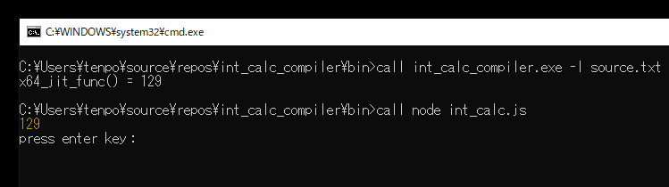
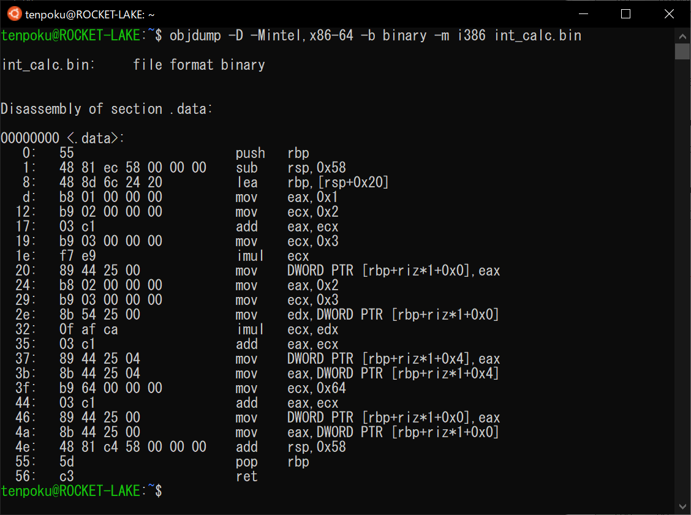

## 2.8 x64 コード生成

中間コード生成で出力された WebAssembly バイナリ表現を読み込んで、外部のアセンブラは使わずに x64 の機械語を出力して JIT 実行します。
この章で作るコンパイラでは、
[int_calc_compiler/src/lib/tp_compiler/tp_make_x64_code.c](https://github.com/tenpoku1000/int_calc_compiler/blob/master/src/lib/tp_compiler/tp_make_x64_code.c)
：tp_make_x64_code 関数が該当します。WebAssembly の仕様のサブセット実装であるため、前節で説明した中間コード生成で出力された WebAssembly バイナリ表現の範囲外はエラーになります。

この節は、[2.11 参考文献・資料](11_Bibliography.md)にある参考書やインテルの公式マニュアルなどを参照しながら読むようにすると、理解が進むと思います。
概要レベルだと、以下のページが参考になると思います。

x64 アセンブリーの概要 | iSUS  
https://www.isus.jp/others/introduction-to-x64-assembly/

本書の x64 アセンブリは、Intel 記法です。

### 2.8.1 Node.js による WebAssembly の実行結果との照合

以下のようなソースコードをコンパイルして出力された x64 の機械語の JIT 実行結果と、
中間コード生成で出力された WebAssembly バイナリ表現の [Node.js](https://nodejs.org/ja/) による実行結果が一致することが確認できれば、
x64 コード生成の開発やテストが進んだことになる目安となります。

```
int32_t value1 = (1 + 2) * 3;
int32_t value2 = 2 + (3 * value1);
value1 = value2 + 100;
```



Node.js のスクリプト int_calc.js の内容は、以下の通りです。int_calc.wasm ファイルを読み込んでコンパイルし、calc 関数を実行して返り値をコンソールに出力します。

```
const { readFileSync } = require("fs");

const run = async () => {
    const buffer = readFileSync("./int_calc.wasm");
    const module = await WebAssembly.compile(buffer);
    const instance = await WebAssembly.instantiate(module);
    console.log(instance.exports.calc());
};

run();
```

### 2.8.2 JIT 実行する手順

1. convert_section_code_content2x64 関数で、出力する x64 の機械語のサイズを取得します。

2. VirtualAlloc() Windows API で、1. のサイズの読み書き可能なメモリ領域を確保します。実際に確保されるサイズは、ページ単位になります。第6章でページングについて説明します。

3. convert_section_code_content2x64 関数で、2. のメモリ領域に x64 の機械語を出力します。

4. VirtualProtect() Windows API で、2. のメモリ領域を書き込み不可で実行可能にします。

5. x64_jit_func func = (x64_jit_func)x64_code_buffer; で、2. のメモリ領域を関数へのポインタにキャストします。

6. int value = func(); で、関数へのポインタ経由で 2. のメモリ領域に書かれた x64 の機械語を実行します。返り値を変数に保存します。これが機械語の実行結果です。

7. printf("x64_jit_func() = %d\n", value); で、機械語の実行結果を標準出力に出力します。

8. VirtualFree() Windows API で、2. のメモリ領域を解放します。

```
typedef int (*x64_jit_func)(void);

bool tp_make_x64_code(TP_SYMBOL_TABLE* symbol_table, int32_t* return_value)
{
    uint8_t* x64_code_buffer = NULL;

    uint32_t x64_code_buffer_size1 = convert_section_code_content2x64(symbol_table, NULL);

    if (0 == x64_code_buffer_size1){

        goto convert_error;
    }

    x64_code_buffer = (uint8_t*)VirtualAlloc(
        NULL, x64_code_buffer_size1,
        MEM_RESERVE | MEM_COMMIT, PAGE_READWRITE
    );

    if (NULL == x64_code_buffer){

        TP_GET_LAST_ERROR(symbol_table);

        goto convert_error;
    }

    uint32_t x64_code_buffer_size2 = convert_section_code_content2x64(symbol_table, x64_code_buffer);

    if (0 == x64_code_buffer_size2){

        goto convert_error;
    }

    if (x64_code_buffer_size1 != x64_code_buffer_size2){

        goto convert_error;
    }

    DWORD old_protect = 0;

    if ( ! VirtualProtect(x64_code_buffer, x64_code_buffer_size2, PAGE_EXECUTE_READ, &old_protect)){

        TP_GET_LAST_ERROR(symbol_table);

        goto convert_error;
    }

    x64_jit_func func = (x64_jit_func)x64_code_buffer;

    int value = func();

    if ( ! symbol_table->member_is_no_output_messages){

        printf("x64_jit_func() = %d\n", value);
    }

    if (return_value){

        *return_value = value;
    }

    errno_t err = _set_errno(0);

    if ( ! VirtualFree(x64_code_buffer, 0, MEM_RELEASE)){

        TP_GET_LAST_ERROR(symbol_table);

        return false;
    }

    x64_code_buffer = NULL;

    return true;

convert_error:

    if (x64_code_buffer){

        if ( ! VirtualFree(x64_code_buffer, 0, MEM_RELEASE)){

            TP_GET_LAST_ERROR(symbol_table);
        }

        x64_code_buffer = NULL;
    }

    return false;
}
```

### 2.8.3 スタックマシンである WebAssembly から、x64 の機械語に変換する方法

スタックマシンである WebAssembly から、レジスタマシンの x64 へ変換は、コンパイラの WebAssembly を解釈するためのスタックを使って、
WebAssembly を解釈しながら x64 の命令をエンコードしていきます。そのようにしないと、入れ子になった式などが機械的に変換できないです。

次項以降で、中間コード(WebAssembly バイナリ表現)から x64 の機械語を生成する手順を細かく見ていきます。

* 2.8.4 可変長整数 LEB128 のデコード
* 2.8.5 関数のプロローグ：ローカル変数と一時変数の x64 のスタックへの確保
* 2.8.6 関数のプロローグ：関数のスタック・サイズ
* 2.8.7 レジスタの割り当てと解放
* 2.8.8 x64 機械語のエンコード
* 2.8.9 関数のエピローグ

例として、以下のようなソースコードをコンパイルできることを前提としています。

```
int32_t value1 = (1 + 2) * 3;
int32_t value2 = 2 + (3 * value1);
value1 = value2 + 100;
```

以下は、上記のソースコードをコンパイルして出力された中間コード(WebAssembly バイナリ表現)を、wabt の wasm2wat コマンドで WebAssembly テキスト表現に変換したものです。

```
(module
  (type (;0;) (func (result i32)))
  (func (;0;) (type 0) (result i32)
    (local i32 i32)
    i32.const 1
    i32.const 2
    i32.add
    i32.const 3
    i32.mul
    local.set 0
    i32.const 2
    i32.const 3
    local.get 0
    i32.mul
    i32.add
    local.set 1
    local.get 1
    i32.const 100
    i32.add
    local.tee 0)
  (table (;0;) 0 funcref)
  (memory (;0;) 1)
  (export "memory" (memory 0))
  (export "calc" (func 0)))
```

以下は、上記の中間コード(WebAssembly バイナリ表現)から生成した x64 の機械語を、WSL の Ubuntu の objdump コマンドで逆アセンブルしたものです。



```
$ objdump -D -Mintel,x86-64 -b binary -m i386 int_calc.bin

int_calc.bin:     file format binary


Disassembly of section .data:

00000000 <.data>:
   0:	55                   	push   rbp
   1:	48 81 ec 58 00 00 00 	sub    rsp,0x58
   8:	48 8d 6c 24 20       	lea    rbp,[rsp+0x20]
   d:	b8 01 00 00 00       	mov    eax,0x1
  12:	b9 02 00 00 00       	mov    ecx,0x2
  17:	03 c1                	add    eax,ecx
  19:	b9 03 00 00 00       	mov    ecx,0x3
  1e:	f7 e9                	imul   ecx
  20:	89 44 25 00          	mov    DWORD PTR [rbp+riz*1+0x0],eax
  24:	b8 02 00 00 00       	mov    eax,0x2
  29:	b9 03 00 00 00       	mov    ecx,0x3
  2e:	8b 54 25 00          	mov    edx,DWORD PTR [rbp+riz*1+0x0]
  32:	0f af ca             	imul   ecx,edx
  35:	03 c1                	add    eax,ecx
  37:	89 44 25 04          	mov    DWORD PTR [rbp+riz*1+0x4],eax
  3b:	8b 44 25 04          	mov    eax,DWORD PTR [rbp+riz*1+0x4]
  3f:	b9 64 00 00 00       	mov    ecx,0x64
  44:	03 c1                	add    eax,ecx
  46:	89 44 25 00          	mov    DWORD PTR [rbp+riz*1+0x0],eax
  4a:	8b 44 25 00          	mov    eax,DWORD PTR [rbp+riz*1+0x0]
  4e:	48 81 c4 58 00 00 00 	add    rsp,0x58
  55:	5d                   	pop    rbp
  56:	c3                   	ret    
```

例として、以下のようなソースコードをコンパイルしてみます。

```
int32_t value1 = (1 + 2) * 3;
```

WebAssembly は、スタックを使って処理を進めていく「スタックマシン」なので、例として上記のソースコードをスタックマシンで表現してみます。
まず、式：(1 + 2) \* 3 を逆ポーランド記法：1 2 + 3 \* に書き換えます。式の左から順にスタックを使って計算をすると、
以下のようにスタックの状態が変化し、計算結果 9 が得られます。push は、スタックに値を積む操作で、演算子 + と \* はスタックに積まれた値を取り出して、計算した結果を
スタックに積みます。tee_local は、スタックから値を取り出してローカル変数にセットし、再びスタックに値を積みます。

```
          push 1 -> スタックの状態：1
          push 2 -> スタックの状態：1 2
               + -> スタックの状態：3
          push 3 -> スタックの状態：3 3
               * -> スタックの状態：9
tee_local value1 -> スタックの状態：9   (計算結果)
```

上記の push や +, \* などを WebAssembly で置き換えてみます。以下のようになります。tee_local 0 の 0 は、1 つ目のローカル変数を意味します。

```
     i32.const 1 -> スタックの状態：1
     i32.const 2 -> スタックの状態：1 2
     i32.add     -> スタックの状態：3
     i32.const 3 -> スタックの状態：3 3
     i32.mul     -> スタックの状態：9
     tee_local 0 -> スタックの状態：9   (計算結果)
```

コンパイラの WebAssembly を解釈するためのスタックを使って、WebAssembly を解釈しながら x64 の命令をエンコードしていくメインの処理を見ていきます。
次項以降で、解説していない WebAssembly の命令は可能な限り省略しています。

1. get_wasm_export_code_section 関数で、Export セクション -> Function セクション -> Type セクション -> Code セクションの順に WebAssembly の内容を検査して、
Code セクションへのポインタと、返り値の型を取得します。C 言語の int32_t calc(void) 関数相当が、Export セクションで外部に公開されていることを前提にしています。

2. wasm_stack_and_use_register_init 関数で、コンパイラの WebAssembly を解釈するためのスタックを初期化します。

3. tp_encode_allocate_stack 関数で、関数のプロローグのコード生成を行います。「2.8.5 関数のプロローグ：ローカル変数と一時変数の x64 のスタックへの確保」で説明します。

4. TP_X64_CHECK_CODE_SIZE マクロで、x64 の命令のサイズが 0 の場合、生成エラーなのでエラーを意味する 0 を呼び出し元の関数に返します。

5. WebAssembly の end 命令(オペコード 0x0b)を読み取るか、エラーで中断するまで、ループを実行します。

wasm_stack_pop 関数で、Code セクションの関数本体の内容を読み取り、オペコードに続いてオペランド(引数)を持つ命令の場合はオペランドも読み取って両者を統合します。
続いて、コンパイラの WebAssembly を解釈するためのスタックに PUSH します。

WebAssembly のオペコードで分岐し、コンパイラの WebAssembly を解釈するためのスタックから、オペランドの数(0 以上)と同じ回数、POP します。
POP した値は、以下で使います。

WebAssembly のオペコードと 0 個以上のオペランドに対応する x64 の機械語を生成します。WebAssembly のオペコードによっては、
コンパイラの WebAssembly を解釈するためのスタックに PUSH する場合があります。「2.8.7 レジスタの割り当てと解放」で説明します。

TP_X64_CHECK_CODE_SIZE マクロで、x64 の命令のサイズが 0 の場合、生成エラーなのでエラーを意味する 0 を呼び出し元の関数に返します。

6. WebAssembly の end 命令(オペコード 0x0b)を読み取った場合の処理です。

tp_encode_end_code 関数で、関数のエピローグのコード生成を行います。「2.8.9 関数のエピローグ」で説明します。

TP_X64_CHECK_CODE_SIZE マクロで、x64 の命令のサイズが 0 の場合、生成エラーなのでエラーを意味する 0 を呼び出し元の関数に返します。

wasm_stack_pop 関数で、コンパイラの WebAssembly を解釈するためのスタックから POP します。

wasm_stack_and_wasm_code_is_empty 関数で、コンパイラの WebAssembly を解釈するためのスタックが空であることを検査し、
スタックが空でない場合は WebAssembly の解釈エラーなので、エラーを意味する 0 を呼び出し元の関数に返します。

WebAssembly の calc 関数に対応する x64 の機械語のサイズを呼び出し元の関数に返します。これが、正常終了の場合の動作です。

```
#define TP_X64_CHECK_CODE_SIZE(symbol_table, x64_code_size, tmp_x64_code_size) \
\
    do{ \
        if (0 == (tmp_x64_code_size)){ \
\
            TP_PUT_LOG_MSG( \
                (symbol_table), TP_LOG_TYPE_DISP_FORCE, \
                TP_MSG_FMT("ERROR: 0 == tmp_x64_code_size at %1 function."), \
                TP_LOG_PARAM_STRING(__func__) \
            ); \
\
            return 0; \
        } \
\
        (x64_code_size) += (tmp_x64_code_size); \
    }while (false)

static uint32_t convert_section_code_content2x64(TP_SYMBOL_TABLE* symbol_table, uint8_t* x64_code_buffer)
{
    uint32_t x64_code_size = 0;

    TP_WASM_MODULE_SECTION* code_section = NULL;
    uint32_t return_type = 0;

    if ( ! get_wasm_export_code_section(symbol_table, &code_section, &return_type)){

        TP_PUT_LOG_MSG_TRACE(symbol_table);

        goto error_proc;
    }

(中略)

    if ( ! wasm_stack_and_use_register_init(symbol_table, wasm_code_body_buffer, wasm_code_body_size)){

        TP_PUT_LOG_MSG_TRACE(symbol_table);

        goto error_proc;
    }

    uint32_t tmp_x64_code_size = tp_encode_allocate_stack(
        symbol_table, x64_code_buffer, x64_code_size, var_count, var_type
    );

    TP_X64_CHECK_CODE_SIZE(symbol_table, x64_code_size, tmp_x64_code_size);

    do{
        TP_WASM_STACK_ELEMENT op1 = { 0 };
        TP_WASM_STACK_ELEMENT op2 = { 0 };

        TP_WASM_STACK_ELEMENT opcode = wasm_stack_pop(symbol_table, TP_WASM_STACK_POP_MODE_DEFAULT);

        switch (opcode.member_wasm_opcode){
        case TP_WASM_OPCODE_TEE_LOCAL:
            op1 = wasm_stack_pop(symbol_table, TP_WASM_STACK_POP_MODE_PARAM);
            tmp_x64_code_size = tp_encode_tee_local_code(
                symbol_table, x64_code_buffer, x64_code_size, opcode.member_local_index, &op1
            );
            break;
        case TP_WASM_OPCODE_I32_CONST:
            tmp_x64_code_size = tp_encode_i32_const_code(symbol_table, x64_code_buffer, x64_code_size, opcode.member_i32);
            break;
        case TP_WASM_OPCODE_I32_ADD:
            op2 = wasm_stack_pop(symbol_table, TP_WASM_STACK_POP_MODE_PARAM);
            op1 = wasm_stack_pop(symbol_table, TP_WASM_STACK_POP_MODE_PARAM);
            tmp_x64_code_size = tp_encode_i32_add_code(symbol_table, x64_code_buffer, x64_code_size, &op1, &op2);
            break;
        case TP_WASM_OPCODE_I32_MUL:
            op2 = wasm_stack_pop(symbol_table, TP_WASM_STACK_POP_MODE_PARAM);
            op1 = wasm_stack_pop(symbol_table, TP_WASM_STACK_POP_MODE_PARAM);
            tmp_x64_code_size = tp_encode_i32_mul_code(symbol_table, x64_code_buffer, x64_code_size, &op1, &op2);
            break;
        case TP_WASM_OPCODE_END:

            tmp_x64_code_size = tp_encode_end_code(symbol_table, x64_code_buffer, x64_code_size);

            TP_X64_CHECK_CODE_SIZE(symbol_table, x64_code_size, tmp_x64_code_size);

            op1 = wasm_stack_pop(symbol_table, TP_WASM_STACK_POP_MODE_PARAM);

            if ( ! wasm_stack_and_wasm_code_is_empty(symbol_table)){

                TP_PUT_LOG_MSG_TRACE(symbol_table);

                goto error_proc;
            }

            return x64_code_size;
        default:

            TP_PUT_LOG_MSG_ICE(symbol_table);

            goto error_proc;
        }

        TP_X64_CHECK_CODE_SIZE(symbol_table, x64_code_size, tmp_x64_code_size);

    }while (true);

error_proc:

    return 0;
}
```

### 2.8.4 可変長整数 LEB128 のデコード

WebAssembly で i32.const 100 の 100 が 0xe4 0x00 に変換されるのは、符号ありの LEB128 であることが理由です。中間コード生成で LEB128 にエンコードされた整数を、
x64 コード生成では通常の固定長の整数にデコードします。以下のソースコードは、
[int_calc_compiler/src/lib/tp_compiler/tp_leb128.c](https://github.com/tenpoku1000/int_calc_compiler/blob/master/src/lib/tp_compiler/tp_leb128.c)
からの抜粋です。int32_t 型の値を返す関数と、uint32_t 型の値を返す関数です。WebAssembly の仕様書に書かれている LEB128 の型を参照して、
どちらの関数を使ってデコードするのか判断します。つまり、デコードしたい項目の型を事前に知っておく必要があります。

```
int32_t tp_decode_si32leb128(uint8_t* buffer, uint32_t* size)
{
    uint8_t* p = buffer;

    int32_t value = 0;

    uint8_t byte = 0;

    int32_t shift = 0;

    do{
        byte = *p++;

        value |= ((byte & 0x7f) << shift);

        shift += 7;

    }while (128 <= byte);

    if (byte & 0x40){

        uint64_t init_value = -1;

        value |= (init_value << shift);
    }

    *size = (uint32_t)(p - buffer);

    return value;
}

uint32_t tp_decode_ui32leb128(uint8_t* buffer, uint32_t* size)
{
    uint8_t* p = buffer;

    uint32_t value = 0;

    for (uint32_t shift = 0; ; shift += 7){

        uint8_t byte = *p++;

        value |= ((byte & 0x7f) << shift);

        if (128 > byte){

            break;
        }
    }

    *size = (uint32_t)(p - buffer);

    return value;
}
```

### 2.8.5 関数のプロローグ：ローカル変数と一時変数の x64 のスタックへの確保

C 言語の関数の始まりの部分に相当します。機械語では、CPU にあるレジスタという変数のようなものを使って、計算したりメモリ上の値を操作したりします。
x64 のレジスタやスタックの操作に関するルールは、基本的に x64 版の UEFI でも使われている x64 ソフトウェア規約に従います。Linux などの POSIX 環境とはルールが異なります。

x64 でのソフトウェア規約 | Microsoft Docs  
https://docs.microsoft.com/ja-jp/cpp/build/x64-software-conventions?view=msvc-160&viewFallbackFrom=vs-2017

```
  RSP, RBP レジスタは 64 ビット利用。その他の 14 個の 64 ビット汎用レジスタの下位 32 ビットを利用
                        RSP RBP レジスタ： RSP  RBP ----------------- (呼び出し先の関数内で保存する必要あり)
        関数の返り値が格納されるレジスタ： EAX ---------------------- (呼び出し先の関数内で保存されない)
                        整数引数レジスタ：      ECX  EDX  R8D R9D---- (呼び出し先の関数内で保存されない)
                    従来の揮発性レジスタ： EAX  ECX  EDX ------------ (呼び出し先の関数内で保存されない)
    x64 で追加された新しい揮発性レジスタ： R8D  R9D R10D R11D ------- (呼び出し先の関数内で保存されない)
                  従来の不揮発性レジスタ： EBX  ESI EDI ------------- (呼び出し先の関数内で保存する必要あり)
  x64 で追加された新しい不揮発性レジスタ：R12D R13D R14D R15D ------- (呼び出し先の関数内で保存する必要あり)
```

x64 コード生成で出力する機械語の冒頭部分の内容は、以下の通りです。この章で作るコンパイラの文法では関数はありませんが、ソースコード全体が 1 つの関数としてコンパイルされます。
計算結果は EAX レジスタに格納され、JIT 実行された機械語の呼び出し元であるコンパイラの tp_make_x64_code 関数に返され、標準出力に計算結果の値が出力されます。
不揮発性レジスタを関数のプロローグで x64 のスタックに保存するためには、事前に関数全体をコンパイルしないと保存すべきレジスタが確定しません。
関数の中で、値を変更した不揮発性レジスタのみを x64 のスタックに保存するためです。

1. x64 の RBP レジスタの値を x64 の PUSH 命令で保存します。

2. x64 のスタックに、不揮発性レジスタ RBX, RSI, RDI, R12, R13, R14, R15 の値を x64 の PUSH 命令で保存します。
ただし、レジスタの値を変更していない不揮発性レジスタは保存しません。

3. x64 のスタック・ポインタである RSP レジスタから x64 の SUB 命令で、次項で説明する関数のスタック・サイズを減算します。
SUB 命令の即値オペランドのサイズは 4 バイト固定にします。この理由も、次項で説明します。

4. x64 の RSP レジスタ に 32(この章では使用しない、関数呼び出しのための 64 ビット引数レジスタ 4 個分の領域。次章で説明します)を
加算したアドレス値を x64 の LEA 命令で RBP レジスタにセットします。RBP レジスタを基準として、メモリ上のローカル変数を読み書きします。

### 2.8.6 関数のプロローグ：関数のスタック・サイズ

x64 では、関数呼び出しを行ったり SSE 命令を利用したりする場合に、関数のスタック・サイズが 16 の倍数バイトであることが求められます。
アライメントと呼ばれるデータ配置の決まりです。「16 バイト境界でアラインされる」などと言います。
以下の各領域のサイズが 16 の倍数バイトになるように、各領域ごとに 0 バイト以上の padding 領域を確保します。
ただし、呼び出し元のリターン・アドレス 8 バイト分の差異を埋めるため、スタック終端に 8 バイトの padding 領域を確保する必要がある場合があります(計算した関数のスタック・サイズを 16 で割った余りが 0 の場合)。

* ローカル変数の領域
* 一時変数の領域
* 保存された不揮発性レジスタの値の領域

この章のコンパイラでは、関数のスタックは以下のようなレイアウトになっています。保存された不揮発性レジスタの値の領域以下を、
関数のスタック・サイズとして RSP レジスタから減算します。

```
スタック・フレーム(括弧内の数値の単位はバイト)：
  高位アドレス
    呼び出し元のリターン・アドレス(8)
    保存された RBP レジスタの値(8)
    保存された不揮発性レジスタの値の領域(8 * m) m は 0 ～ 7：不揮発性レジスタ RBX, RSI, RDI, R12, R13, R14, R15
    保存された不揮発性レジスタの値の領域の padding
    一時変数の領域の padding
    この章では未使用：一時変数の領域(4 * p)
    ローカル変数の領域の padding
    ローカル変数の領域(4 * n)
    この章では未使用：関数呼び出しのための 64 ビット引数レジスタ 4 個分の領域(8 * 4 = 32)
    スタック終端の padding：ゼロまたは 8 バイト(計算した関数のスタック・サイズ % 16) が 0 の場合は 8、それ以外は 0)
  低位アドレス

padding の計算式： ( -「padding を必要とする領域のバイト数」) & (16 - 1)
```

1. WebAssembly のローカル変数の領域は、Code セクションの各関数の本体の冒頭にローカル変数の型と数が記録されているので、それを参照して x64 のスタックに確保します。

2. ソースコードに出現しない一時変数の領域は、事前に関数全体をコンパイルしないとサイズが確定しません。WebAssembly の命令を解釈する必要があるためです。事項で説明します。

3. x64 のスタック領域を確保するため、RSP レジスタから x64 の SUB 命令で関数のスタック・サイズを減算しますが、
即値オペランドのサイズが、padding バイトの確保前と確保後で 1 バイト になったり 4 バイトになったりする可能性を排除するため、関数のスタック・サイズは 4 バイト固定にします。

関数のスタック・サイズの内訳は、デバッグ用途のために int_calc_log.log ファイルに出力されます。スタック・サイズ member_stack_imm32 が 88 なので、16 で割った余りが 8 のため正常です。

```
tp_make_x64_code_body.c(211): sub rsp, imm32
symbol_table->member_stack_imm32(member_register_bytes is not included): 88
symbol_table->member_register_bytes: 16
symbol_table->member_padding_register_bytes: 0
symbol_table->member_temporary_variable_size: 36
symbol_table->member_padding_temporary_variable_bytes: 0
symbol_table->member_local_variable_size: 8
symbol_table->member_padding_local_variable_bytes: 4
symbol_table->member_last_padding_bytes: 8
stack_param_size: 32
```

Windows アプリで、サイズの大きいスタック領域を確保する場合、アプリからアクセス可能なスタック領域であることを検査するヘルパー関数が必要です。第5章で説明します。

### 2.8.7 レジスタの割り当てと解放

例として、以下のようなソースコードをコンパイルできることを前提としています。

```
int32_t value1 = (1 + 2) * 3;
int32_t value2 = 2 + (3 * value1);
value1 = value2 + 100;
```

WebAssembly は、スタックを使って処理を進めていく「スタックマシン」なので、例として上記のソースコードの 1 行目の式：(1 + 2) \* 3 をスタックマシンで表現してみます。
まず、式：(1 + 2) \* 3 を逆ポーランド記法：1 2 + 3 \* に書き換えます。式の左から順にスタックを使って計算をすると、
以下のようにスタックの状態が変化し、計算結果 9 が得られます。push は、スタックに値を積む操作で、演算子 + と \* はスタックに積まれた値を取り出して、計算した結果を
スタックに積みます。

```
push 1 -> スタックの状態：1
push 2 -> スタックの状態：1 2
     + -> スタックの状態：3
push 3 -> スタックの状態：3 3
     * -> スタックの状態：9   (計算結果)
```

上記の push や +, \* を WebAssembly で置き換えてみます。以下のようになります。

```
i32.const 1 -> スタックの状態：1
i32.const 2 -> スタックの状態：1 2
i32.add     -> スタックの状態：3
i32.const 3 -> スタックの状態：3 3
i32.mul     -> スタックの状態：9   (計算結果)
```

WebAssembly でスタックへ PUSH すると、ソースコードに現れない一時変数が発生すると考えます。
この一時変数を x64 のレジスタに割り当てて、x64 の機械語を生成することにします。

以下は、WebAssembly の i32.const 命令(オペコード 0x41)に対応する x64 の機械語を生成する関数です。
tp_allocate_temporary_variable 関数で、一時変数を x64 のスタックに確保してレジスタに割り当て、
encode_x64_mov_imm 関数で、x64 の MOV 命令で 32 ビット整数をレジスタに転送しています。
tp_wasm_stack_push 関数で、コンパイラの WebAssembly 解釈用のスタックに一時変数を PUSH しています。

```
uint32_t tp_encode_i32_const_code(
    TP_SYMBOL_TABLE* symbol_table, uint8_t* x64_code_buffer, uint32_t x64_code_offset, int32_t value)
{
    TP_WASM_STACK_ELEMENT result = {
        .member_wasm_opcode = TP_WASM_OPCODE_I32_VALUE
    };

    uint32_t x64_code_size = 0;

    if ( ! tp_allocate_temporary_variable(symbol_table, TP_X64_ALLOCATE_DEFAULT,
        x64_code_buffer, x64_code_offset, &x64_code_size, &result)){

        TP_PUT_LOG_MSG_TRACE(symbol_table);

        return 0;
    }

    uint32_t tmp_x64_code_size = encode_x64_mov_imm(
        symbol_table, x64_code_buffer, x64_code_offset,
        value, TP_X64_MOV_IMM_MODE_FORCE_IMM32, &result
    );

    TP_X64_CHECK_CODE_SIZE(symbol_table, x64_code_size, tmp_x64_code_size);

    if ( ! tp_wasm_stack_push(symbol_table, &result)){

        TP_PUT_LOG_MSG_TRACE(symbol_table);

        return 0;
    }

    return x64_code_size;
}
```

WebAssembly と対応するスタックの状態を再掲します。

```
i32.const 1 -> スタックの状態：1
i32.const 2 -> スタックの状態：1 2
i32.add     -> スタックの状態：3
i32.const 3 -> スタックの状態：3 3
i32.mul     -> スタックの状態：9   (計算結果)
```

以下は、WebAssembly の i32.add 加算命令(オペコード 0x6a)と、 i32.mul 乗算命令(オペコード 0x6c)に対応する x64 の機械語を生成する関数です。
tp_encode_x64_2_operand 関数で、コンパイラの WebAssembly 解釈用のスタックから取り出した 2 つの一時変数から x64 の加算命令や乗算命令を生成します。
tp_encode_x64_2_operand 関数の内部で tp_free_register 関数を呼んで、2 つ目の一時変数に割り当てられているレジスタを解放しています。
tp_wasm_stack_push 関数で、1 つ目の一時変数をコンパイラの WebAssembly 解釈用のスタックに、再度 PUSH しています。
WebAssembly の i32.add 命令や i32.mul 命令では、一時変数の使い回しが出来ると考えられます。関数の返り値が格納されるレジスタが EAX レジスタであることから、
一時変数は EAX レジスタに優先的に割り当てることにします。

```
uint32_t tp_encode_i32_add_code(
    TP_SYMBOL_TABLE* symbol_table, uint8_t* x64_code_buffer, uint32_t x64_code_offset,
    TP_WASM_STACK_ELEMENT* op1, TP_WASM_STACK_ELEMENT* op2)
{
    // ADD
    uint32_t x64_code_size = tp_encode_x64_2_operand(
        symbol_table, x64_code_buffer, x64_code_offset, TP_X64_ADD, op1, op2
    );

    if ( ! tp_wasm_stack_push(symbol_table, op1)){

        TP_PUT_LOG_MSG_TRACE(symbol_table);

        return 0;
    }

    return x64_code_size;
}

uint32_t tp_encode_i32_mul_code(
    TP_SYMBOL_TABLE* symbol_table, uint8_t* x64_code_buffer, uint32_t x64_code_offset,
    TP_WASM_STACK_ELEMENT* op1, TP_WASM_STACK_ELEMENT* op2)
{
    // IMUL – Signed Multiply
    uint32_t x64_code_size = tp_encode_x64_2_operand(
        symbol_table, x64_code_buffer, x64_code_offset, TP_X64_IMUL, op1, op2
    );

    if ( ! tp_wasm_stack_push(symbol_table, op1)){

        TP_PUT_LOG_MSG_TRACE(symbol_table);

        return 0;
    }

    return x64_code_size;
}
```

命令長を短くするため、x64 になってから追加されたレジスタよりも、従来から利用できたレジスタを優先的に利用するように、一時変数をレジスタに割り当てます。
x64 のスタック関連命令以外にも、命令によっては特定のレジスタを利用する場合がありますが、今回は乗算と除算の場合のみ考慮します。これらについては、次項で説明します。

### 2.8.8 x64 機械語のエンコード

x64 の機械語を出力するソースコードを書く前に、以下の資料に内容を整理してから開発を始めました。

x64 の 64 ビットモードのエンコーディング概略  
https://gist.github.com/tenpoku1000/24c249e32c512611c079ce87a59a6a52

32 ビット汎用レジスタを使う場合でも、x64 になってから追加されたレジスタ(R8D R9D R10D R11D R12D R13D R14D R15D)については、REX プリフィックスが必要です。

PUSH/POP 命令以外で、RSP レジスタを基準としてメモリにアクセスする場合、SIB バイトが必要です。
将来の拡張性を考慮し、RBP レジスタを基準とした場合でも、SIB バイトを必要とするアドレッシング・モードを使います。

メモリ-メモリ間演算はできません。オペランドの一方がレジスタである必要があります。

符号付き乗算の IMUL 命令で、EAX レジスタとの乗算を行うエンコーディングを選択すると、オペコードを 1 バイト削減できます。
以下の imul ecx が該当します。以下の imul ecx, edx より 1 バイト少ないです。
現代の CPU では命令長が短いことが必ずしも高速化につながるとは言い難い面もありますが、可能な限り小さいコード・サイズに最適化するという目的には、使えると思います。
ちりも積もれば山となるというわけです。

```
$ objdump -D -Mintel,x86-64 -b binary -m i386 int_calc.bin

int_calc.bin:     file format binary


Disassembly of section .data:

00000000 <.data>:
   0:	55                   	push   rbp
   1:	48 81 ec 58 00 00 00 	sub    rsp,0x58
   8:	48 8d 6c 24 20       	lea    rbp,[rsp+0x20]
   d:	b8 01 00 00 00       	mov    eax,0x1
  12:	b9 02 00 00 00       	mov    ecx,0x2
  17:	03 c1                	add    eax,ecx
  19:	b9 03 00 00 00       	mov    ecx,0x3
  1e:	f7 e9                	imul   ecx
  20:	89 44 25 00          	mov    DWORD PTR [rbp+riz*1+0x0],eax
  24:	b8 02 00 00 00       	mov    eax,0x2
  29:	b9 03 00 00 00       	mov    ecx,0x3
  2e:	8b 54 25 00          	mov    edx,DWORD PTR [rbp+riz*1+0x0]
  32:	0f af ca             	imul   ecx,edx
  35:	03 c1                	add    eax,ecx
  37:	89 44 25 04          	mov    DWORD PTR [rbp+riz*1+0x4],eax
  3b:	8b 44 25 04          	mov    eax,DWORD PTR [rbp+riz*1+0x4]
  3f:	b9 64 00 00 00       	mov    ecx,0x64
  44:	03 c1                	add    eax,ecx
  46:	89 44 25 00          	mov    DWORD PTR [rbp+riz*1+0x0],eax
  4a:	8b 44 25 00          	mov    eax,DWORD PTR [rbp+riz*1+0x0]
  4e:	48 81 c4 58 00 00 00 	add    rsp,0x58
  55:	5d                   	pop    rbp
  56:	c3                   	ret    
```

符号付き除算の IDIV 命令で、「ローカル変数 = ローカル変数 / レジスタ」または、
「ローカル変数 = ローカル変数 / ローカル変数」のようなコード生成が行われようとした場合に、
「(EDX レジスタ：上位 32 ビット(xor edx, edx で 0 をセット), EAX レジスタ：下位 32 ビット) / 他のレジスタまたはメモリ」
という除算を行うエンコーディングを選択しました。計算結果は、EAX レジスタに商が、EDX レジスタに剰余がセットされます。
IDIV 命令の実行時よりも前の値を壊さないようにするため、単純に PUSH/POP 命令で RAX/RDX レジスタを退避・復旧しています。レジスタに空きがあれば、
x64 のスタックではなく RAX/RDX 以外のレジスタに退避させるように改良する余地があります。

```
push rax
push rdx
xor edx, edx
idiv eax, レジスタまたはローカル変数
mov ローカル変数, eax
pop rdx
pop rax
```

### 2.8.9 関数のエピローグ

WebAssembly の end 命令(オペコード 0x0b)に対応する x64 の機械語を生成します。C 言語の関数の終わりの部分に相当します。

1. x64 のスタックに保存していた不揮発性レジスタ RBX, RSI, RDI, R12, R13, R14, R15 の値を、x64 の POP 命令で各レジスタに復旧します。保存していない不揮発性レジスタは POP しません。

2. x64 のスタック・ポインタである RSP レジスタに x64 の ADD 命令で関数のスタックサイズを加算して、RSP レジスタの値を復旧します。

3. x64 のスタックに保存していた RBP レジスタの値を、x64 の POP 命令で RBP レジスタに復旧します。

4. x64 の RET 命令で、呼び出し元の関数に復帰します。呼び出し元の関数は、機械語を JIT 実行で呼び出したコンパイラの tp_make_x64_code 関数です。

