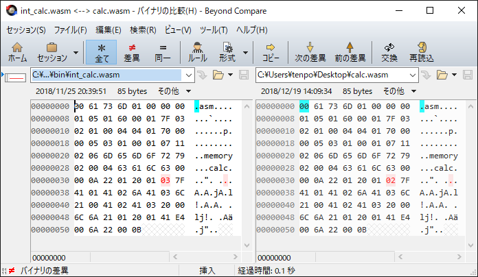

## 2.9 デバッグとテストコード

書籍や blog 記事などでは、コンパイラのデバッグやテストについて、あまり解説されているものを見かけないため、簡単な例を説明します。

### 2.9.1 バグ修正の例(1)

先に修正したソースコードのパッチの場所を書いておきます。

[int_calc_compiler/src/lib/tp_compiler/tp_make_parse_tree.c](https://github.com/tenpoku1000/int_calc_compiler/commit/3a14df2ba25f43810456c22c3d6447ab066b12af#diff-ef260b6c957dfbbdf172ff3e72b2f027)

以下のソースコードをコンパイルして出力された WebAssebly バイナリ表現と、以下のソースコードを WebAssembly テキスト表現に
書き直したものを wabt の wat2wasm コマンドで WebAssebly バイナリ表現に変換したものを比較した際に、関数のローカル変数の数が一致しないという問題が見つかりました。

```
int32_t value1 = (1 + 2) * 3;
int32_t value2 = 2 + (3 * value1);
value1 = value2 + 100;
```



上記のソースコードに対応する文法は、以下の通りです。

```
Program -> Statement+
Statement -> Type? variable '=' Expression ';'
Expression -> Term (('+' | '-') Term)*
Term -> Factor (('*' | '/') Factor)*
Factor -> '(' Expression ')' | ('+' | '-')? (variable | constant)
Type -> int32_t
```

意味解析で、変数を定義する文法：Statement -> Type variable '=' Expression ';' が 3 回、認識されたことが中間コード生成に伝わり、
関数のローカル変数の数 が 3 であると出力されたものと、推定しました。wabt の wat2wasm コマンドでは 2 が出力されていました。

ソースコードを構文解析して得られた構文木は、デバッグ用途のために int_calc_parse_tree.log ファイルに出力できるようになっています。
以下は、int_calc_parse_tree.log ファイルの内容を抜粋したものです。変数を定義する文法が 3 回出現していて、3 回目は先頭に int32_t ではなく value1 が記録されているため
不正な文法であることが判明しました。代入文の文法：Statement -> variable '=' Expression ';' を、変数を定義する文法：Statement -> Type variable '=' Expression ';' として
内容を誤って構文木を出力するプログラム・ミスを修正することができました。

```
=== Dump all parse tree. ===

   {
    TP_PARSE_TREE_GRAMMER_PROGRAM
    TP_PARSE_TREE_TYPE_NODE
       {
        TP_PARSE_TREE_GRAMMER_PROGRAM
        TP_PARSE_TREE_TYPE_NODE
           {
            TP_PARSE_TREE_GRAMMER_STATEMENT_2
            TP_PARSE_TREE_TYPE_TOKEN
               {
                TP_SYMBOL_ID
                TP_SYMBOL_TYPE_INT32
                 member_line(0)
                 member_column(0)
                 member_string(int32_t)
                 member_i32_value(0)
               }

        TP_PARSE_TREE_TYPE_NODE
           {
            TP_PARSE_TREE_GRAMMER_STATEMENT_2
            TP_PARSE_TREE_TYPE_TOKEN
               {
                TP_SYMBOL_ID
                TP_SYMBOL_TYPE_INT32
                 member_line(1)
                 member_column(1)
                 member_string(int32_t)
                 member_i32_value(0)
               }

    TP_PARSE_TREE_TYPE_NODE
       {
        TP_PARSE_TREE_GRAMMER_STATEMENT_2
        TP_PARSE_TREE_TYPE_TOKEN
           {
            TP_SYMBOL_ID
            TP_SYMBOL_ID_INT32
             member_line(2)
             member_column(1)
             member_string(value1)
             member_i32_value(0)
           }
```

### 2.9.2 バグ修正の例(2)

先に修正したソースコードのパッチの場所を書いておきます。

[int_calc_compiler/src/lib/tp_compiler/tp_semantic_analysis.c](https://github.com/tenpoku1000/int_calc_compiler/commit/3a14df2ba25f43810456c22c3d6447ab066b12af#diff-4ccf43d5fea1436688ce644981091d12)

前項のバグは、変数 value1 が多重定義されていることを検出できていれば、コンパイル時にエラーになるため、その時点で気づくことができるはずでした。
参照しやすいように、以下にソースコードを再掲します。

```
int32_t value1 = (1 + 2) * 3;
int32_t value2 = 2 + (3 * value1);
value1 = value2 + 100;
```

意味解析で、変数名をハッシュ表に登録する際に、すでに変数名が登録されている場合にエラーにしていなかったプログラム・ミスを修正することができました。
前節のバグ修正で、代入文：value1 = value2 + 100; が変数定義文にコンパイルされる不具合は解消していますから、先頭に int32_t 型を付けてコンパイルしてみると、
以下のようにコンパイル時に変数の多重定義エラーを検出することができるようになりました。

```
C:\>type source.txt:
int32_t value1 = (1 + 2) * 3;
int32_t value2 = 2 + (3 * value1);
int32_t value1 = value2 + 100;

C:\>int_calc_compiler.exe -l source.txt
tp_semantic_analysis.c(278): ERROR: Duplicate DEFINED_REGISTER_OBJECT at register_defined_variable function.
tp_compiler.c(457): ERROR: Compile failed.
```

### 2.9.3 自動テスト

プログラムの動作を非常に具体的かつ詳細にテストするコードを書いている時間はなかったため、計算結果を正常値と比較することと、
スナップショット(出力されるバイナリや log など)を取得可能にし、スナップショットを比較することで、ソースコードの修正が以前の正常な動作を変えていないことを確認可能にしました。
スナップショットは、スナップショット格納フォルダ(test_YYYY-MM-DD_nnn)に出力されます。

Windows の PowerShell やコマンド・プロンプト、Python などの既存のスクリプト言語に依存してしまうと、自作 OS 上で動作させることが難しくなるため、
テスト・ケースと、自動で複数のテストを一括して実行するロジックをコンパイラ本体に内蔵
 [int_calc_compiler/src/lib/tp_compiler/tp_compiler.c](https://github.com/tenpoku1000/int_calc_compiler/blob/master/src/lib/tp_compiler/tp_compiler.c)
 しています。テスト・ケースは、以下の通りです。

```
typedef struct test_case_table_{
    uint8_t* member_source_code;
    int32_t member_return_value;
}TEST_CASE_TABLE;

static TEST_CASE_TABLE test_case_table[] = {

    { "int32_t value1 = 1 + 2;\n", 3 },
    { "int32_t value1 = 1 - 2;\n", -1 },
    { "int32_t value1 = 1 * 2;\n", 2 },
    { "int32_t value1 = 4 / 2;\n", 2 },

    { "int32_t value1 = 1;\n"
    "int32_t value2 = value1 + 2;\n", 3 },

    { "int32_t value1 = 1;\n"
    "int32_t value2 = value1 - 2;\n", -1 },

    { "int32_t value1 = 1;\n"
    "int32_t value2 = value1 * 2;\n", 2 },

    { "int32_t value1 = 4;\n"
    "int32_t value2 = value1 / 2;\n", 2 },

    { "int32_t value1 = 1;\n"
    "int32_t value2 = 2 + value1;\n", 3 },

    { "int32_t value1 = 1;\n"
    "int32_t value2 = 2 - value1;\n", 1 },

    { "int32_t value1 = 1;\n"
    "int32_t value2 = 2 * value1;\n", 2 },

    { "int32_t value1 = 2;\n"
    "int32_t value2 = 4 / value1;\n", 2 },

    { "int32_t value1 = 1;\n"
    "int32_t value2 = 2;\n"
    "int32_t value3 = value1 + value2;\n", 3 },

    { "int32_t value1 = 1;\n"
    "int32_t value2 = 2;\n"
    "int32_t value3 = value1 - value2;\n", -1 },

    { "int32_t value1 = 1;\n"
    "int32_t value2 = 2;\n"
    "int32_t value3 = value1 * value2;\n", 2 },

    { "int32_t value1 = 4;\n"
    "int32_t value2 = 2;\n"
    "int32_t value3 = value1 / value2;\n", 2 },

    { "int32_t value1 = (1 + 2) * 3;\n"
    "int32_t value2 = 2 + (3 * value1);\n"
    "value1 = value2 + 100;\n", 129 },

    { NULL, 0 }
};
```

